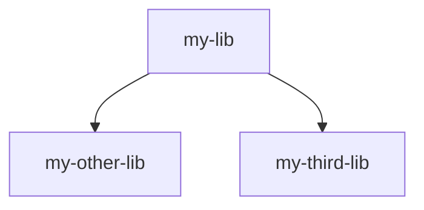
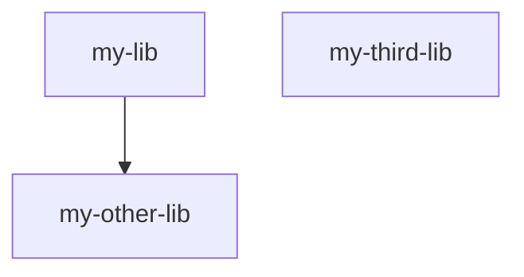

# nx-dotnet-depgraph-issue-reproducer

reprdouces an issue with nx-dotnet dependency graph in which global dependencies are not factored into the dependency graph.

## Install

```sh
npm i
```

## Testing

```sh
npx nx graph
```

## Overview

`my-lib` has a direct dependency on `my other-lib`.
Additionally, it has an indirect dependency on `my-third-lib` through `Directory.Build.props`.

## Expected

The dependency graph should look like this:


## Actual

The dependency graph looks like this:

